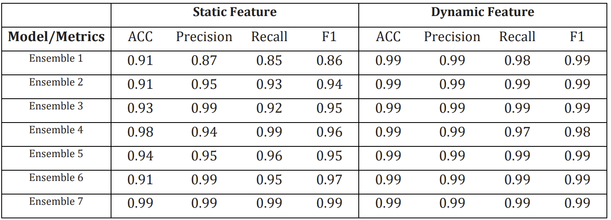
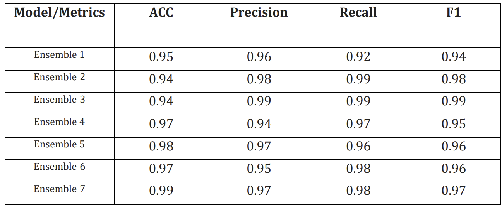

# Mitigating adversarial evasion attacks of ransomware using ensemble learning
This research focuses on reducing evasion attacks in Android ransomware detection, such as code obfuscation used to evade detection as malware or ransomware. The authors propose an effective combined technique of both static features (e.g., permissions, text-based features, network-based features, etc.) and dynamic features (such as system call logs, CPU and memory usage) to detect Android ransomware using a synthesis machine learning model.

## Technique
- *__Static Analysis__*: decompiling APK files examinining the code and structure of Android applications without executing them. It focuses on extracting information directly from the application package (APK) file to assess potential security risks and behavior patterns.
- *__Dynamic Analysis__*: executing the application in a controlled environment to observe its behavior at runtime. Unlike static analysis, which examines the code without execution, dynamic analysis provides insights into how the application interacts with the device and network. 
- *__Ensemble Learning__*: combining multiple machine learning models to improve classification accuracy and robustness.

## Enviroment and tool
- *__APKTool__*: Decompiling APK files into .dex,  AndroidManifest.xml, .etc
- *__Genymotion__*: An emulator can create Android phone or tablet which provides more capacity to run a large number of malware programs within a reasonable time.
- *__Monkey Runner__*: A tool provided by Android for automated testing of applications and devices. It is primarily used for testing the functionality and performance of Android applications through a series of simulated user interactions

## Result
The evaluation of dynamic and static classsifier are shown in the table below:
 

The evaluation using `OR` voting algorithm. The final result will indicate whether it is ransomware or non-ransomware. The evaluation metrics for the final result are shown in the table below.
